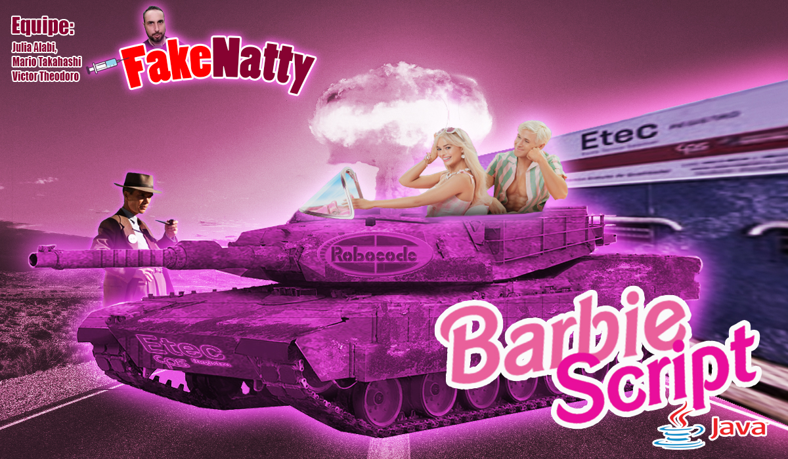
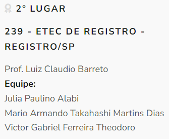

# **BarbieScript - RoboCode 2023 - ETEC-Registro**

### **Introdução:**
Em 2023, durante nosso primeiro ano do ensino médio na ETEC de Registro, eu **[(Victor Theodoro)](https://github.com/VTheodoro)** e meus colegas de classe, **[Mario Takahashi](https://github.com/mariotdias)** e **[Julia Alabi](https://github.com/JuliaAlabi)** , embarcamos em uma emocionante jornada no mundo da programação e da robótica, participando do 11º Torneio de RoboCode. Com dedicação, trabalho em equipe e muita criatividade, conquistamos o primeiro lugar dentro da nossa instituição.

### **A Competição:**
O RoboCode é uma competição de programação de robôs virtuais utilizando a linguagem Java e o software RoboCode. Nossos robôs, incluindo o BarbieScript, foram desafiados a competir em uma arena virtual, onde estratégia e programação determinavam o vencedor. A competição foi organizada pelo Centro Paula Souza e a Robótica Paula Souza.

### **Nossa Jornada:**
Durante meses, mergulhamos em intensas sessões de programação, utilizando a documentação fornecida pelos nossos professores dos cursos de Desenvolvimento de Sistemas da ETEC **[Ramon Trigo](https://github.com/ramtrigodev)** e Luiz Claudio Barreto, que nos deram a oportunidade de participar. Com base no conhecimento limitado em Java, exploramos a documentação e trabalhamos em equipe para criar o BarbieScript, inspirado no filme lançamento do momento, Barbie. Fizemos uma documentação detalhada para entregar ao professor, incluindo uma capa representando nosso robô.

### **O Pódio:**
Nas finais, contra outras ETECs e Fatecs da região, levamos nossa determinação e habilidades ao máximo, competindo em um ambiente ainda mais desafiador. Com grande orgulho, conquistamos o segundo lugar, demonstrando não apenas nossa capacidade técnica, mas também nossa resiliência e habilidade de adaptação em situações competitivas.

### **Reconhecimento:**
Nossa jornada no 11º Torneio de RoboCode não foi apenas sobre conquistar troféus e medalhas. Foi sobre aprender, crescer e superar desafios. Recebemos reconhecimento não apenas pela colocação no pódio, mas também pelo trabalho árduo, pela dedicação e pela paixão que dedicamos ao projeto. Os brindes e medalhas que ganhamos são testemunhos tangíveis do nosso sucesso, mas as lições aprendidas e as memórias criadas são os verdadeiros tesouros desta jornada.

### **Conclusão:**
Participar do 11º Torneio de RoboCode da ETEC de Registro foi uma experiência transformadora que nos desafiou, nos inspirou e nos uniu como equipe. Este projeto no GitHub é mais do que apenas um repositório de código; é um testemunho da nossa jornada de sucesso, um lembrete do que podemos alcançar quando trabalhamos juntos e nos esforçamos para alcançar nossos objetivos.

### **Agradecimentos:**
Gostaríamos de expressar nossa gratidão aos organizadores do Torneio de RoboCode da ETEC de Registro, aos nossos professores e mentores que nos apoiaram ao longo do caminho, e, é claro, aos nossos colegas de equipe, Mario Armando Takahashi Martins Dias e Julia Alabi, cuja determinação e trabalho em equipe foram fundamentais para nosso sucesso.
s. 

## **Links:**

**[Link para download da plataforma do RoboCode
](https://sourceforge.net/projects/robocode/files/
)**

**[Link da Página Oficial da ETEC de Registro Sobre a 5º Competição de RoboCode, Fotos do Evento e Seus Vecedores
](http://etecregistro.edu.br/bloginteg.php?id=NDg2
)**

**[Link da Página Oficial da Robótica Paula Souza Sobre o 11º Torneio de RoboCode e Seus Vencedores
](http://www.robotica.cpscetec.com.br/verEventos.php?pag=50
)**

**[Link do Live de Premiação dos Vencedores do Torneio
](https://www.youtube.com/watch?v=e-7UfXoVjW8
)**

